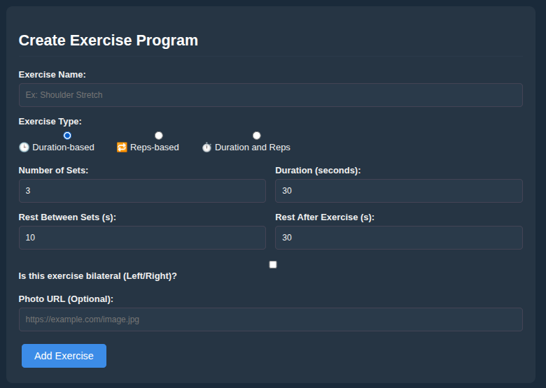
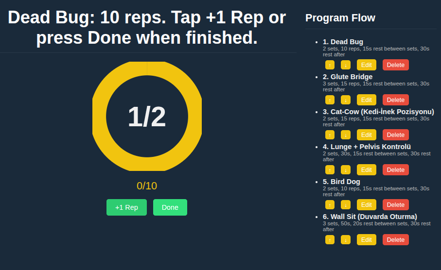
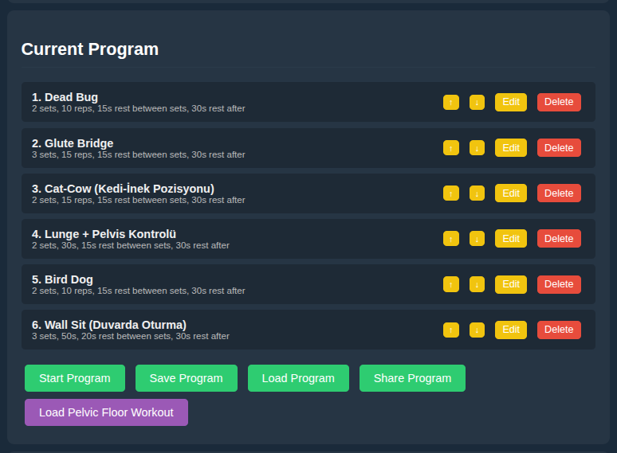
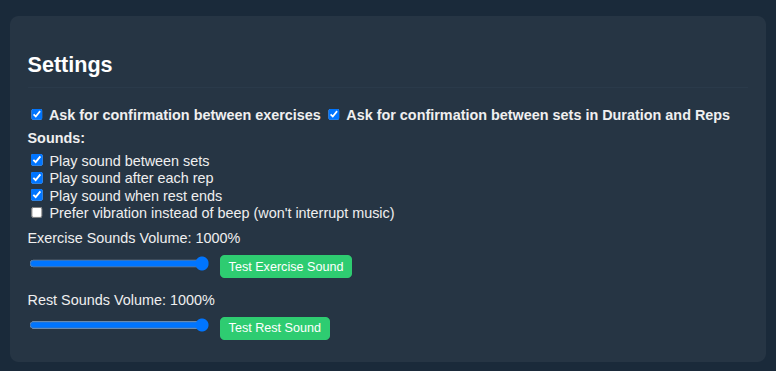

# 🏋️‍♂️ Stretch Timer & Workout Manager

**A progressive web application designed to manage stretching routines, physical therapy exercises (e.g., Hyperlordosis correction), and interval workouts.**

This project started as a simple loop timer and has evolved into a fully customizable workout manager capable of handling complex routines, repetition counting, and program persistence.

---

## 🚀 Project Evolution

### Phase 1: The Beginning (v1.0)
The initial version of this project was a straightforward **Interval Timer**. It was designed with a simple goal: provide a loop for stretching.

* **Features:** Global settings for set count, stretch duration, and rest duration.
* **Design:** Minimalist interface focused on a single repeating loop.
* **Limitation:** It could only handle one type of duration for all sets.


*(v1.0: The initial "Orange Theme" interface with global timer settings)*

---

### Phase 2: The Workout Manager (v2.0 & Current)
The project underwent a complete overhaul to support **complex workout routines**. The focus shifted from a simple timer to a "Workout Builder" that supports specific exercises, repetition tracking, and data persistence.

#### 1. Advanced Program Creation
Unlike v1, the new version allows you to build a routine exercise by exercise.
* **Hybrid Inputs:** You can now choose between **Duration-based** (e.g., Planks), **Reps-based** (e.g., Crunches), or **Hybrid** exercises.
* **Customization:** Each exercise has its own set count, rest intervals, and specific targets.



#### 2. Routine Management & Persistence
Users can now see their entire workout flow, reorder exercises, and save their favorite routines (e.g., "Level 1" or "Morning Stretch") directly to the browser's Local Storage.




#### 3. Interactive Workout Mode
The execution screen was redesigned for better focus.
* **Visual Cues:** A large progress ring indicates the remaining time or reps.
* **Manual & Auto Modes:** For rep-based exercises, the timer waits for user confirmation ("Done" button) before proceeding to the rest period.



#### 4. Enhanced Settings
Added granular control over the user experience, including:
* **Audio Feedback:** Distinct sounds for start, rest, and complete.
* **Confirmation Toggles:** Options to auto-advance or wait for user input between sets.



---

## 🛠️ Tech Stack

* **Core:** HTML5, CSS3, JavaScript (ES6+)
* **Storage:** Web LocalStorage API (for saving programs)
* **Styling:** Custom CSS with a responsive dark theme
* **Audio:** Native HTML5 Audio API

## 📦 How to Use

Since this is a client-side web application, no installation is required.

1.  **Clone the repository:**
    ```bash
    git clone [https://github.com/Alprslnayhn/Stretch-Timer---Organize-Your-Stretching-Routine.git](https://github.com/Alprslnayhn/Stretch-Timer---Organize-Your-Stretching-Routine.git)
    ```
2.  **Open the file:**
    Navigate to the folder and double-click `index.html` (or the latest `.html` file) to open it in your web browser.

## 🤝 Contributing

Contributions are welcome! If you have ideas for new features (e.g., export to PDF, cloud sync), feel free to fork the repo and submit a pull request.

1.  Fork the Project
2.  Create your Feature Branch (`git checkout -b feature/AmazingFeature`)
3.  Commit your Changes (`git commit -m 'Add some AmazingFeature'`)
4.  Push to the Branch (`git push origin feature/AmazingFeature`)
5.  Open a Pull Request

## 📄 License

Distributed under the MIT License. See `LICENSE` for more information.

---
*Developed by [Alprslnayhn](https://github.com/Alprslnayhn)*
