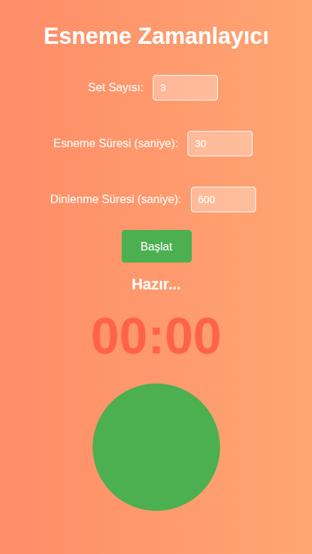

# 🏋️‍♂️ Stretch Timer & Workout Manager

  

**A comprehensive, web-based workout assistant designed to organize physical therapy routines, interval training, and flexibility sessions.**

> "What started as a simple Python loop timer has evolved into a full-featured Progressive Web Application."

---

## 📈 Project Evolution (Before & After)

This project demonstrates a clear journey from a basic script to a complex UI application.

### v1.0: The Legacy Script
Initially, the project was a simple interval timer with a minimalist orange interface. It was limited to fixed durations and lacked program storage.


*(Fig 1: The initial prototype focused on simple loops)*

---

### v2.0: The Modern Workout System (Current)
The application has been completely rewritten to support **complex routines**, **repetition tracking**, and **local data persistence**.

### 🌟 Key Features

#### 1. Advanced Routine Builder
Unlike standard timers, you can customize every aspect of your workout.
* **Hybrid Support:** Add exercises based on **Time** (e.g., Planks), **Reps** (e.g., Squats), or both.
* **Granular Control:** Set specific rest intervals for "between sets" vs "after exercise".


#### 2. Dynamic Dashboard & Program Management
Visualize your entire workout flow. You can edit, reorder, or delete exercises on the fly.
* **Persistence:** Save your favorite routines (like "Morning Stretch" or "Hyperlordosis Fix") directly to your browser.


#### 3. Focus Mode (Active Workout)
The execution screen is designed to minimize distractions.
* **Visual Cues:** A large, color-coded progress ring.
* **Interaction:** Manual "Done" button for rep-based exercises ensures you control the pace.


#### 4. Custom Audio & Settings
Tailor the experience to your environment.
* **Audio Feedback:** Distinct sounds for start, rest, and finish.
* **Safety:** Option to require confirmation before advancing to the next exercise.


---

## 🛠️ Technical Stack

* **Frontend:** HTML5, CSS3 (Flexbox/Grid), JavaScript (ES6+)
* **State Management:** Custom JS State Machine for handling Timer/Rest/Rep logic.
* **Storage:** Web `localStorage` API for persisting user programs.
* **Design:** Responsive Dark Mode UI.

---

## 🚀 How to Run

Since this is a client-side web application, no installation is required.

1.  **Clone the repository:**
    ```bash
    git clone [https://github.com/Alprslnayhn/Stretch-Timer---Organize-Your-Stretching-Routine.git](https://github.com/Alprslnayhn/Stretch-Timer---Organize-Your-Stretching-Routine.git)
    ```
2.  **Launch:**
    Simply open the `index.html` file in any modern web browser (Chrome, Firefox, Safari).

> **Tip:** For the best experience with audio features, it is recommended to use a local server (e.g., VS Code Live Server or Python `http.server`).

---

## 🤝 Contributing

Contributions make the open-source community an amazing place to learn. Any contributions you make are **greatly appreciated**.

1.  Fork the Project
2.  Create your Feature Branch (`git checkout -b feature/NewFeature`)
3.  Commit your Changes
4.  Push to the Branch
5.  Open a Pull Request

---

## 📄 License

Distributed under the MIT License. See `LICENSE` for more information.

---
*Developed by [Alprslnayhn](https://github.com/Alprslnayhn)*
